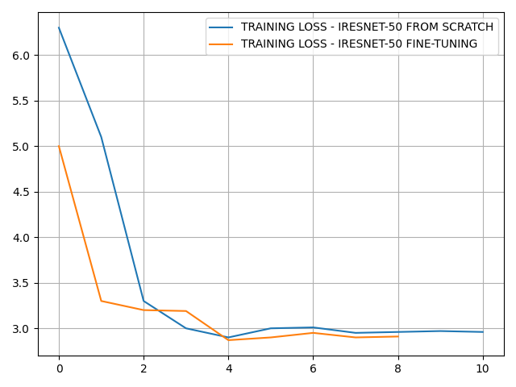
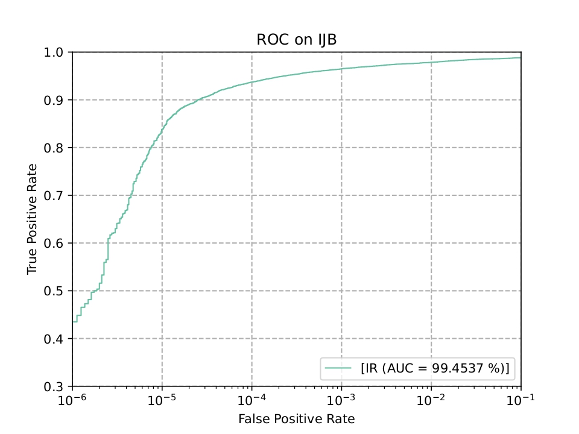
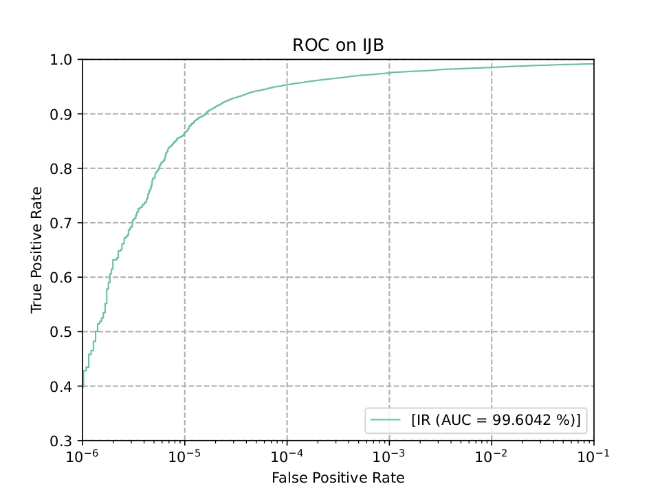

# Facial Recognition System

**Lê Trọng Ngọc, Nguyễn Ngọc Minh, Trần Thị Huyền, Bùi Như Ý**<br>
Khoa Công nghệ Thông tin, Đại học Công nghiệp Thành phố Hồ Chí Minh<br>
Liên hệ: 22685841.minh@student.iuh.edu.vn, 22728001.y@student.iuh.edu.vn, 22657821.huyen@student.iuh.edu.vn, ngoc.le@fulbrightmail.org

Dự án xây dựng hệ thống nhận diện khuôn mặt dựa trên học sâu, kết hợp RetinaFace cho phát hiện/căn chỉnh khuôn mặt, backbone CNN hoặc Vision Transformer để trích xuất đặc trưng, và AdaFace để học embedding thích nghi theo chất lượng ảnh. Mô hình được huấn luyện trên VGGFace2 và đánh giá trên các bộ dữ liệu LFW, AGEDB-30, CFP-FP, CFP-FF, IJB-B và IJB-C.

## Tài Nguyên

- Model/checkpoint: https://drive.google.com/drive/folders/1U-K9FSWov8-qZcDAAM9MNDTaMi0ILL3p?usp=sharing
- Dataset: https://drive.google.com/drive/folders/1E4rXfu1p60XOYwgFW31G20OyciwLu5s9?usp=sharing
- Hướng dẫn train notebook: [TRAIN.md](TRAIN.md)
- Notebook train: [train.ipynb](train.ipynb)

## Nội Dung Chính

- Phát hiện khuôn mặt bằng RetinaFace.
- Căn chỉnh khuôn mặt dựa trên landmark, crop/resize về kích thước `112x112`.
- Trích xuất embedding 512 chiều bằng IResNet-18, IResNet-50 hoặc ViT.
- Huấn luyện với AdaFace loss để tăng khả năng phân biệt identity trong điều kiện ảnh có chất lượng khác nhau.
- So khớp embedding bằng cosine similarity.
- Đánh giá bằng Accuracy và TAR@FAR trên các benchmark chuẩn.
- Thử nghiệm kết hợp đặc trưng truyền thống Gabor/HOG với embedding học sâu.

## Cấu Trúc Thư Mục

```text
.
+-- train.ipynb                 # Notebook huấn luyện trên Google Colab
+-- TRAIN.md                    # Hướng dẫn chạy notebook train
+-- requirements.txt            # Danh sách thư viện Python
+-- net.py                      # Backbone IResNet
+-- head.py                     # AdaFace head
+-- trainer.py                  # Training loop
+-- data.py                     # Dataset và dataloader
+-- utils.py                    # Hàm tiện ích train/evaluate
+-- ViT/                        # Backbone Vision Transformer
+-- expert/                     # Đặc trưng Gabor, HOG
+-- validation/                 # Đánh giá Accuracy
+-- validation_mixed/           # Đánh giá IJB-B/IJB-C
+-- notebooks/                  # Notebook demo, eval và train phụ
+-- img/                        # Hình ảnh, biểu đồ trong báo cáo
```

## Phương Pháp

Pipeline của hệ thống gồm 4 giai đoạn:

1. **Face Detection**: phát hiện khuôn mặt và landmark bằng RetinaFace.
2. **Face Alignment**: căn chỉnh khuôn mặt theo landmark, đưa ảnh về kích thước chuẩn `112x112`.
3. **Feature Extraction**: trích xuất vector embedding 512 chiều bằng backbone IResNet hoặc ViT.
4. **Matching**: so khớp embedding bằng cosine similarity; nếu vượt ngưỡng threshold thì xem là cùng danh tính, ngược lại là unknown.

Trong quá trình huấn luyện, AdaFace điều chỉnh margin dựa trên chất lượng mẫu ảnh, giúp mô hình học tốt hơn với ảnh rõ/nét và giảm tác động của ảnh chất lượng thấp.


### Phát Hiện Và Căn Chỉnh Khuôn Mặt

RetinaFace được sử dụng để phát hiện vùng khuôn mặt và các landmark quan trọng. Sau đó ảnh được căn chỉnh, crop và resize về kích thước `112x112` trước khi đưa vào backbone.


### Tăng Cường Dữ Liệu

Trong quá trình train, ảnh đầu vào có thể được tăng cường bằng các phép biến đổi như lật ngang, mô phỏng ảnh độ phân giải thấp, crop và thay đổi điều kiện quang học để tăng khả năng tổng quát hóa của mô hình.


### Đặc Trưng Truyền Thống

Ngoài embedding học sâu, báo cáo còn thử nghiệm kết hợp các đặc trưng truyền thống như Gabor Filters và HOG để so sánh hiệu quả.


## Dữ Liệu

Theo báo cáo, dữ liệu huấn luyện chính là VGGFace2 đã được tiền xử lý theo chuẩn nhận diện khuôn mặt: phát hiện khuôn mặt, căn chỉnh landmark và resize về `112x112`. Các tập validation/evaluation gồm:


- LFW
- AGEDB-30
- CFP-FP
- CFP-FF
- IJB-B
- IJB-C

Dataset của dự án được cung cấp tại:

https://drive.google.com/drive/folders/1E4rXfu1p60XOYwgFW31G20OyciwLu5s9?usp=sharing

## Cài Đặt

Môi trường khuyến nghị:

- Python 3.10+
- PyTorch có CUDA
- GPU NVIDIA nếu train model

Cài đặt dependency:

```bash
pip install -r requirements.txt
```

Nếu chạy trên Google Colab, notebook `train.ipynb` sẽ cài thêm:

```bash
pip install menpo
pip install fvcore
apt-get install -y p7zip-full
```

## Huấn Luyện

Mở `train.ipynb` trên Google Colab và chạy lần lượt các cell:

1. Mount Google Drive.
2. Cài đặt thư viện và clone source.
3. Giải nén dataset.
4. Cấu hình đường dẫn dataset/checkpoint/pretrained.
5. Khởi tạo dataloader, model, AdaFace head và optimizer.
6. Train và lưu checkpoint.
7. Evaluate trên validation set và IJB-B/IJB-C nếu đã chuẩn bị dữ liệu benchmark.

Các biến quan trọng trong notebook:

```python
TRAIN_DATA_PATH = '/content/dataset/train'
ACCURACY_VAL_PATH = '/content/val_data/data'
CHECKPOINT = '/content/drive/MyDrive/checkpoints/VGG+Asian/ir_50_checkpoint_3.pth'
SAVE_CHECKPOINT_DIR = '/content/drive/MyDrive'
PRE_TRAINED_PATH = '/content/drive/MyDrive/pretrained/adaface_ir50_webface4m.ckpt'

BATCH_SIZE = 256
MODEL_NAME = 'ir_50'  # ir_18, ir_50, vit
LEARNING_RATE = 0.01
EPOCHS = 4
```

Hướng dẫn chi tiết cách chạy notebook nằm trong [TRAIN.md](TRAIN.md).

Minh họa quá trình huấn luyện và biến thiên loss/accuracy:




## Kết Quả Accuracy

Kết quả Accuracy (%) trên các bộ dữ liệu verification:

| Method | AGE DB | LFW | CFP-FP | CFP-FF |
| :--- | ---: | ---: | ---: | ---: |
| SphereFace | 97.05 | 99.67 | 96.84 | - |
| CosFace | 98.17 | 99.87 | 98.26 | - |
| MagFace | 98.17 | 99.83 | 98.46 | - |
| IResNet-18 | 99.48 | 99.55 | 95.10 | 99.46 |
| IResNet-50 | 94.80 | 99.60 | 96.24 | 99.49 |
| IResNet-50 Fine-tuning | 97.10 | 99.80 | 97.11 | 99.80 |
| IResNet-50 + Taylor Softmax | 96.77 | 99.75 | 97.20 | 99.80 |
| ViT Fine-tuning | 96.57 | 99.83 | 97.46 | 99.85 |
| IResNet-18 + Gabor | 94.13 | 99.50 | 94.86 | 99.55 |
| ViT + Gabor | 96.25 | 99.85 | 97.36 | 99.82 |
| IResNet-50 + Gabor | 96.70 | 99.70 | 96.83 | 99.80 |
| IResNet-18 + HOG | 64.03 | 82.52 | 50.00 | 49.05 |
| IResNet-50 + HOG | 65.10 | 82.75 | 50.00 | 49.00 |
| ViT + HOG | 64.97 | 82.73 | 50.00 | 49.05 |

## Kết Quả TAR@FAR

Kết quả TAR@FAR (%) trên IJB-B và IJB-C:

| Method | IJB-B 1e-4 | IJB-B 1e-5 | IJB-C 1e-4 | IJB-C 1e-5 |
| :--- | ---: | ---: | ---: | ---: |
| SphereFace | 89.19 | 73.58 | 91.77 | 83.33 |
| CosFace | 94.01 | 89.25 | 95.56 | 92.68 |
| MagFace | 94.33 | 89.88 | 95.81 | 93.67 |
| IResNet-18 | 89.82 | 81.37 | 91.90 | 86.67 |
| IResNet-50 | 91.34 | 84.75 | 93.42 | 89.36 |
| IResNet-50 Fine-tuning | 93.15 | 81.27 | 94.99 | 88.84 |
| IResNet-50 + Taylor Softmax | 93.72 | 83.81 | - | - |
| ViT Fine-tuning | 94.06 | 85.88 | 95.76 | 91.44 |
| IResNet-18 + Gabor | 89.07 | 79.72 | 91.14 | 85.34 |
| IResNet-50 + Gabor | 92.77 | 80.57 | 94.62 | 88.14 |
| ViT + Gabor | 93.36 | 84.92 | 95.31 | 90.53 |
| IResNet-18 + HOG | 0.64 | 0.16 | 0.56 | 0.19 |
| IResNet-50 + HOG | 0.68 | 0.16 | 0.58 | 0.21 |
| ViT + HOG | 0.68 | 0.16 | 0.58 | 0.21 |

Đường cong ROC:





## Triển Khai Hệ Thống

Hệ thống được mô tả theo mô hình Client-Server gồm:

- GUI hiển thị camera và kết quả nhận diện.
- Backend API/WebSocket xử lý khung hình theo thời gian thực.
- Vector database FAISS để lưu và truy vấn embedding.

Luồng xử lý:

1. **Enrollment**: thu thập nhiều ảnh của mỗi người dùng, phát hiện/căn chỉnh khuôn mặt, trích xuất embedding 512 chiều và lưu vào cơ sở dữ liệu.
2. **Inference**: nhận frame từ camera, trích xuất embedding, so khớp cosine similarity với cơ sở dữ liệu, trả về danh tính nếu điểm tương đồng vượt ngưỡng.


## Ghi Chú

- Model và dataset cần được tải từ các link Google Drive ở mục **Tài Nguyên**.
- Khi train trên Colab, nếu gặp lỗi hết VRAM hãy giảm `BATCH_SIZE`.
- Nếu muốn train từ đầu, đặt `CHECKPOINT = ''`.
- Nếu muốn fine-tuning, giữ `PRE_TRAINED_PATH` trỏ tới checkpoint pretrained phù hợp.
